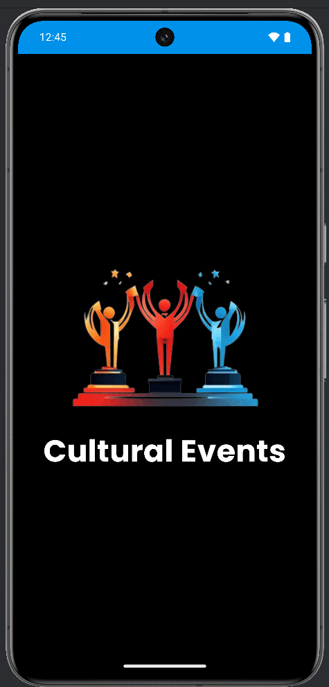

# CulturalEvents

CulturalEvents es una aplicación móvil diseñada para ayudarte a organizar y descubrir eventos culturales de
manera eficiente. Con una interfaz amigable y funcionalidades prácticas, puedes mantenerte al día con tus
eventos favoritos y personalizar tu experiencia.

## Funcionalidades Principales

- **Autenticación de Usuarios**: Regístrate y accede a tu cuenta.
- **Pantalla de Inicio**: Descubre los eventos próximos en tu ciudad o región.
- **Gestión de Favoritos**: Marca eventos como favoritos y recibe recordatorios antes de que ocurran.
- **Perfil de Usuario**: Consulta y edita la información de tu cuenta.
- **Configuración y Notificaciones**: Personaliza tu experiencia en la app, incluyendo recordatorios y preferencias.

## Capturas de Pantalla

**Presentación Visual**: Aquí puedes ver las principales pantallas de la app.

> La Secuenncia Muestra:
>
> - [Splash](./doc-assets/1.Splash.png)
> - [Pantalla Inicio de Sesión](./doc-assets/2.Login.png)
> - [Pantalla Registro](./doc-assets/3.Register.png)
> - [Pantalla Inicio](./doc-assets/4.Home.png)
> - [Pantalla Favoritos](./doc-assets/5.Favorite-Home.png)
> - [Pantalla Perfil de Usuario](./doc-assets/6.Profile.png)
> - [Pantalla Configuración](./doc-assets/8.Configuration.png)
> - [Pantalla Notificaciones](./doc-assets/9.Notifications.png)

## Tecnologías Utilizadas

- **Lenguaje**: Kotlin
- **Framework**: Jetpack Compose
- **Librerías**: Retrofit, Room, Coil, Hilt
- **IDE**: Android Studio
- **Server Mock**: [JsonServer](./servermock/db.json)

## Contributors

- [Simonll4](https://github.com/simonll4)
- [MattGoode7](https://github.com/MattGoode7)

---

¡Gracias por usar CulturalEvents! Si tienes preguntas o sugerencias, no dudes en abrir un issue en el repositorio.
